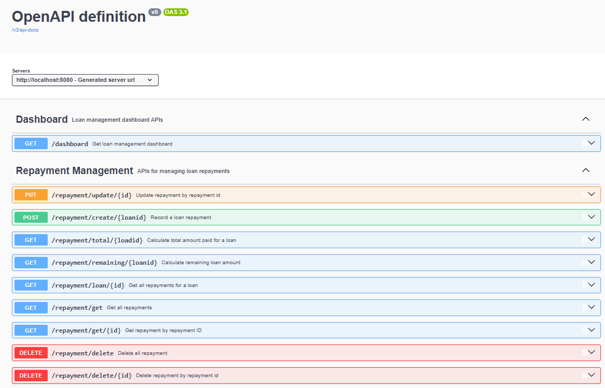
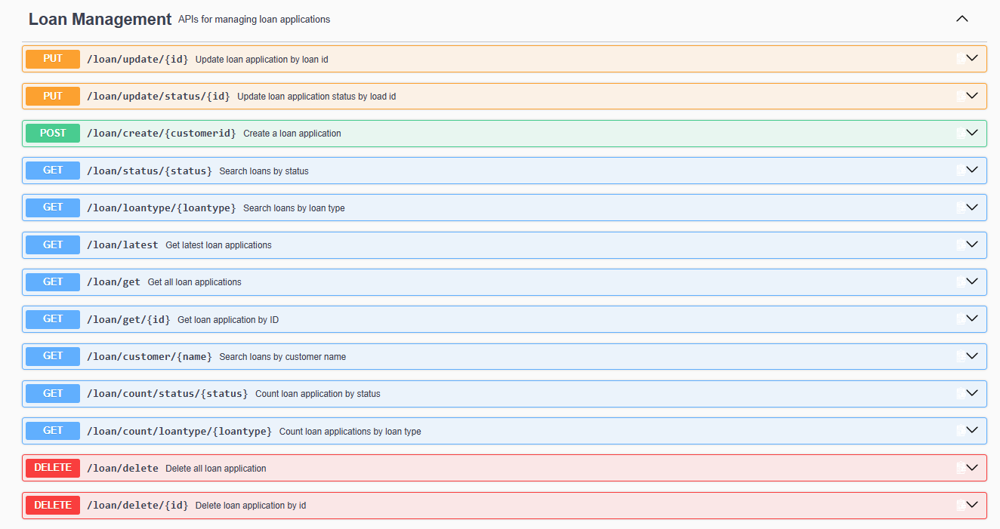
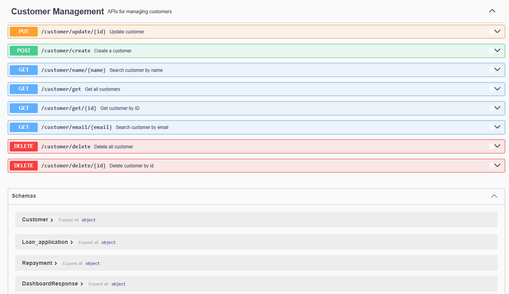
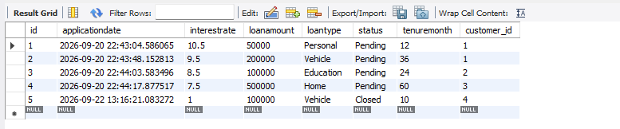
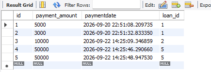
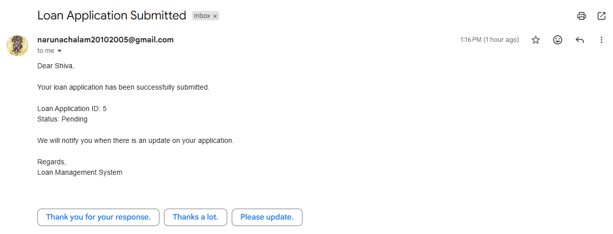
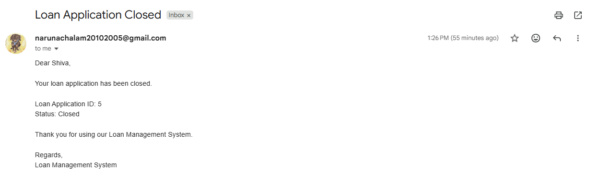

# Loan Application Management & Tracking System

## Features

- Customer management
- Loan application creation and tracking
- Loan approval and status management
- Repayment tracking
- Dashboard APIs
- Email notifications
- Swagger API documentation
- Input validation
- MySQL database integration

## Technologies Used

- Java
- Spring Boot
- Spring Data JPA
- Hibernate
- MySQL
- Swagger OpenAPI
- Java Mail Sender

## Screenshots

### Swagger UI - Repayment and Dashboard APIs

### Swagger UI - Loan APIs

### Swagger UI - Customer APIs

### Loan Application Table

### Repayment Table

### Loan Submitted Email

### Loan Closed Email

